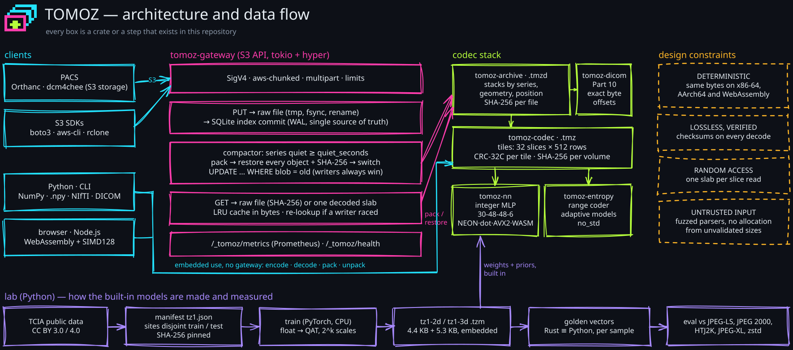

<p align="center">
  <picture>
    <source media="(prefers-color-scheme: dark)" srcset="docs/images/wordmark-carbon.svg">
    
  </picture>
</p>

<p align="center">
  <b>Learned, deterministic lossless compression for medical image volumes.</b><br>
  Byte-exact DICOM archives · an S3 gateway that compacts PACS storage in the background ·
  Rust, Python and WebAssembly
</p>

<p align="center">
  <a href="https://github.com/ZeroXShot/tomoz/actions/workflows/ci.yml"></a>
  <a href="LICENSE"></a>
</p>

---

Medical images must be kept losslessly for years, and CT, MR and PET series
are volumes whose slices are strongly correlated. The lossless codecs used in
DICOM (JPEG-LS, JPEG 2000, HTJ2K, JPEG-XL) code each slice on its own.
Learned codecs do much better in papers, but run on GPUs at well under
1 MB/s and use floating point, so their output depends on the hardware —
unusable for an archive that must decode identically in ten years.

Tomoz predicts every voxel from its 3-D neighbourhood with a small **integer**
neural network and codes the residual with adaptive range coding. It runs on
CPUs (SIMD on x86-64, AArch64 and WebAssembly), decodes any slice without the
rest of the series, and produces **the same bytes on every platform** —
pinned by conformance hashes in CI.

<p align="center"></p>

## Results

On 37 held-out series from 12 public collections that the models never saw
in training — other sites, and vendors (Philips, Fujifilm) and a PET tracer
absent from the training data — every codec verified lossless on every
series. Mean bits per voxel, and how much smaller Tomoz is (mean over
series, 95 % bootstrap interval):

| | CT · 12 series | MR · 9 | PET · 6 |
|---|---|---|---|
| **Tomoz** | **4.17** | **5.05** | **3.22** |
| JPEG-XL, effort 7 | 4.37 · Tomoz −4.6 % [3.1, 6.2] | 5.20 · −3.5 % [0.0, 6.9] | 3.60 · −10.8 % [7.1, 14.8] |
| JPEG-LS | 4.59 · −9.4 % | 5.60 · −11.5 % | 4.07 · −23.2 % |
| JPEG 2000 (reversible) | 4.74 · −12.1 % | 5.64 · −11.8 % | 4.21 · −25.0 % |
| HTJ2K | 5.06 · −17.9 % | 5.93 · −16.2 % | 4.40 · −28.2 % |

On radiographs and mammograms (2-D) Tomoz is on par with JPEG-XL (±1 %).
One Arm Neoverse-N1 core encodes 9.8 MB/s and decodes 10.1 MB/s (JPEG-XL
effort 7: 3.3 and 24 MB/s); four cores 26 and 28 MB/s. Real DICOM series
held out from training, packed as archives: LIDC-IDRI CT, 107.9 MB → 46.1 MB
and 107.4 MB → 41.3 MB, every file restored byte for byte.
[Full results and protocol](docs/evaluation.md).

## What is in the box

| | |
|---|---|
| **Codec** (`tomoz-codec`) | `.tmz` volume container: tiles for parallelism and random access, CRC-32C per tile, SHA-256 per volume, models named by content hash |
| **DICOM archives** (`tomoz-archive`) | A series in one `.tmzd` file, every DICOM file restored byte for byte (headers, padding, private tags, odd bit layouts) |
| **S3 gateway** (`tomoz serve`) | Point Orthanc, dcm4chee or any S3 client at it; it stores uploads, compacts quiet series into archives after verifying them, and serves the original bytes |
| **CLI** (`tomoz`) | Encode/decode `.npy` and NIfTI, pack/unpack DICOM, benchmark |
| **Python** (`tomoz` package) | NumPy in, NumPy out; DICOM archives; abi3 wheels for Linux, macOS and Windows from the release workflow |
| **JavaScript** (`tomoz` package) | WebAssembly build for browsers and Node.js, and a [viewer](crates/tomoz-wasm/js/demo/) that decodes in the page |
| **Lab** (`lab/`) | Public TCIA datasets pinned by hash, quantisation-aware training, golden vectors, the benchmark |

## Quick start

**Command line** (Rust 1.98+; or download a release binary):

```sh
cargo install --git https://github.com/ZeroXShot/tomoz tomoz-cli
tomoz encode ct.npy                 # → ct.npy.tmz
tomoz decode ct.npy.tmz -o back.npy
tomoz dicom pack series/ -o series.tmzd
tomoz dicom unpack series.tmzd -o restored/   # identical files
```

**Python** (`maturin develop --release` in `crates/tomoz-python`, or a release wheel):

```python
import numpy as np, tomoz

volume = np.load("ct.npy")                  # (slices, rows, columns), int16/uint16/uint8/int8
data = tomoz.encode(volume)
assert np.array_equal(tomoz.decode(data), volume)
print(tomoz.info(data)["bits_per_sample"])
```

**Browser / Node.js** (`npm run build` in `crates/tomoz-wasm/js`):

```js
import { load } from "tomoz";
const tomoz = await load();
const { depth, height, width, data } = tomoz.decode(bytes, { slices: [40, 42] });
```

**S3 gateway** with Orthanc storing through it:

```sh
cd examples/orthanc
./init.sh                  # random credentials, never committed
docker compose up -d --build
```

See [examples/orthanc](examples/orthanc/README.md) and the
[gateway documentation](docs/gateway.md).

## How it works

```text
 neighbours ──▶ reference r, activity a ──▶ (v − r)/a, companded to 8 bits
 (rows above, 2 previous slices)                    │
                                                    ▼
                        integer MLP 30-48-48-6 (12 inputs for 2-D)
                                                    │
 left neighbours W, WW, WWW ──▶ exact linear head ◀─┘
                                     │
                     mean (1/16 units), log-scale
                                     │
 flat region? ─ yes ▶ 1 adaptive bit │ no ▶ token (adaptive, 16 symbols, context = scale)
                                     ▼      + bypass low bits + adaptive sign
                          range coder, per tile
```

- **Integer network, exact everywhere.** 8-bit weights and activations,
  32-bit accumulators; the model loader proves no accumulator can overflow,
  so NEON, dot-product, AVX2 and WebAssembly SIMD kernels compute exactly the
  scalar result. Quantisation costs about 1 % ([ADR 0001](docs/decisions/0001-integer-network.md)).
- **Relative context.** The network sees neighbours relative to a reference
  prediction and scaled by local activity, never absolute intensities, so
  one pair of models covers CT, MR, PET and radiography from scanners it has
  never seen ([ADR 0003](docs/decisions/0003-relative-inputs.md)).
- **Hybrid coding.** The network predicts a mean and a scale; adaptive
  classical models code the residual and absorb distribution shift
  ([ADR 0004](docs/decisions/0004-hybrid-coding.md)).
- **Tiles.** Independent slabs × stripes give parallelism and random access
  for ≤ 0.2 % of size; inter-slice prediction is worth 3.5–9 %
  ([ADR 0002](docs/decisions/0002-tiles.md)).

The complete bitstream is specified in [docs/format.md](docs/format.md).

## Correctness and robustness

- **Conformance:** fixed inputs must produce exactly the pinned container
  bytes — natively with every SIMD kernel and the scalar one, in WebAssembly
  with and without SIMD, on Linux, macOS and Windows.
- **Golden vectors:** the Rust codec and the Python training code predict the
  same integers for every sample.
- **Integrity:** CRC-32C per tile and header, SHA-256 per volume and per DICOM
  file, verified on every decode; the gateway restores and checks every
  object before it drops a raw copy.
- **Fuzzing:** every parser of untrusted input (containers, archives, DICOM,
  models, S3 requests) and the pack/restore round trip have fuzz targets;
  they found and fixed an integer overflow in header validation and a lax
  token parser before release.
- **Concurrency:** the gateway's index is the single source of truth with
  atomic file writes; stress tests race readers against overwrites and
  compaction.

## Reproducing the results

Everything comes from public data and the code in this repository:

```sh
cd lab
uv sync --extra train --extra baselines
uv run tomoz-lab fetch --manifest manifests/tz1.json --out ../data/tz1   # ~1 h, 2.7 GB
uv run tomoz-lab train --data ../data/tz1 --out models --threads 3       # ~35 min on 3 cores
uv run tomoz-lab eval --data ../data/tz1 --out ../eval/tz1               # built-in models
```

Methodology and full results: [docs/evaluation.md](docs/evaluation.md).

## Repository

```text
crates/
  tomoz-entropy   range coder and adaptive models (no_std)
  tomoz-nn        integer MLP runtime and SIMD kernels
  tomoz-codec     volume codec, container, built-in models
  tomoz-dicom     DICOM parser and pixel layouts
  tomoz-archive   byte-exact DICOM archives
  tomoz-gateway   S3-compatible server with compaction
  tomoz-cli       the `tomoz` command
  tomoz-python    Python bindings (PyO3)
  tomoz-wasm      WebAssembly build, JavaScript API and viewer
lab/              datasets, training, evaluation (Python)
fuzz/             fuzz targets (cargo fuzz)
docs/             architecture, format, gateway, evaluation, decisions
examples/         Orthanc + Tomoz with Docker Compose
eval/             published evaluation results
```

## Documentation

[Architecture](docs/architecture.md) ·
[Format specification](docs/format.md) ·
[S3 gateway](docs/gateway.md) ·
[Evaluation](docs/evaluation.md) ·
[Design decisions](docs/decisions/README.md) ·
[Security](SECURITY.md) ·
[Contributing](CONTRIBUTING.md)

## Limitations

- Lossless only, and only for native (uncompressed) grayscale pixel data of
  up to 16 bits; colour and already-compressed DICOM files are stored with
  zstd, byte-exact but without Tomoz's gain.
- On single 2-D images (radiographs, mammograms) Tomoz is roughly on par with
  JPEG-XL at high effort; its advantage is on volumes.
- Speed: about 10 MB/s per core encoding and decoding with the AArch64
  dot-product kernel (Neoverse N1), five times less with the portable scalar
  kernel; the AVX2 kernel is tested for exactness but not yet benchmarked.
  Fine for archiving and viewing, not for real-time video.
- The gateway is a single node; it is not a distributed object store.

## Licence and data

Apache-2.0. The built-in models were trained on public collections of The
Cancer Imaging Archive under CC BY licences; see [NOTICE](NOTICE) for
attribution. No image data is distributed with Tomoz.
